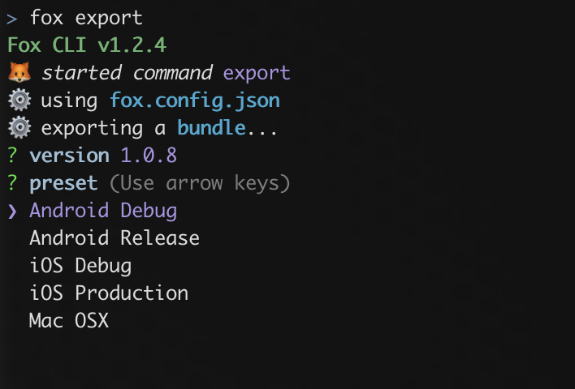

# 🔋 experimental NodeJS CLI

- to watch your files and allow to `live reload` your game.
- to `export` your debug and release bundles.
- to `generate` your release icons and screenshots.



## requirements

To use the CLI you'll need NodeJS installed

### prepare the executable

Install the dev dependencies from the fox folder:

```sh
cd path/to/fox
npm install
```

link the `fox` executable:

macOS:

```sh
ln -s ~/Projects/uralys/gamedev/fox/cli/cli.js /usr/local/bin/fox
```

WSL/Linux:

```sh
sudo ln -s /home/user/Projects/uralys/gamedev/fox/cli/cli.js /usr/local/bin/fox
```

Windows (PowerShell):

Add a function to your PowerShell profile (`$PROFILE`):

```powershell
function fox { node "C:\Users\chris\Projects\uralys\gamedev\fox\cli\cli.js" @args }
```

You may have to reload your terminal to have `fox` in your path;

You can now execute fox commands from your terminal:

```sh
fox
```

You can pass parameters to Godot by using them directly from the command line.

See all available parameters on [Godot CLI Reference](https://docs.godotengine.org/en/stable/tutorials/editor/command_line_tutorial.html#command-line-reference)

Example:

```sh
fox run:game --headless --debug-collisions
```

## usage

```ini
Usage: fox <command> [options]

Commands:
  fox run:editor              open Godot Editor with your main scene

  fox run:game                start your game to debug

  fox export                  export a bundle for one of your presets

  fox generate:icons          generate icons, using a base 1200x1200 image

  fox generate:splashscreens  generate splashscreens, extending a background
                              color from a centered base image

  fox generate:screenshots    resize all images in a folder to 2560x1600, to
                              match store requirements
```

- more details for exporting [here](./docs/export.md)

## hot reload

`fox run:game` watches your project files (`.gd`, `.tscn`, `.cfg`, `.json`, `.yml`) and hot reloads the current scene when a change is detected.

Instead of killing and restarting the Godot process, it writes a `.hot-reload` trigger file. The `HotReload` autoload inside Godot detects this file and calls `Router.reloadCurrentScene()`, which re-instantiates the current scene without closing the window.

### Setup

Add `HotReload` to your project's `[autoload]` section in `project.godot`:

```ini
[autoload]

HotReload="*res://fox/libs/hot-reload.gd"
```

Add `.hot-reload` and `.nav-state` to your `.gitignore`.

### Navigation state (NavState)

The Router persists a typed `NavState` (`fox/core/nav-state.gd`) to `.nav-state` (JSON). It stores the current scene path and a `path` array representing nested sub-view segments — similar to outlets in Ember.js or React Router.

On hot reload or full restart (`r`), the app restores the last visited scene and navigates to the exact sub-view.

**NavState JSON example:**

```json
{"scene_path":"res://src/screens/storybook.tscn","path":["Focal Blur"]}
```

**Router API:**

- `Router.getNavPath() -> Array` — read the current path segments
- `Router.setNavPath(path: Array)` — update and persist the path
- `Router.restoreOrDefault(defaultAction: Callable)` — restore nav state on startup, or call default

**Scene pattern — each scene reads/writes its own path segments:**

```gdscript
func onOpen(options = {}):
    var navPath = Router.getNavPath()
    if not navPath.is_empty():
        selectedEntry = navPath[0]        # restore from navPath
    else:
        selectedEntry = __.GetOr('default', 'entry', options)  # normal nav
    Router.setNavPath([selectedEntry])

func _onSubViewSelected(name: String):
    Router.setNavPath([selectedEntry, name])  # nested sub-view
```

**Startup (main.gd) — use `restoreOrDefault` in debug mode:**

```gdscript
func run():
    Router.restoreOrDefault(func(): Router.openHome())
```

### Limitations

In standalone mode, GDScript files are compiled on load. Hot reload works well for data changes (JSON, resources) and `.tscn` scenes. For `.gd` script changes, the scene is re-instantiated but scripts in memory may not update — use `r` for a full restart in that case.

## shortcuts

- `r` — full restart (kills and relaunches Godot, useful when hot reload is not enough)
- `ctrl + c` — stop the game
