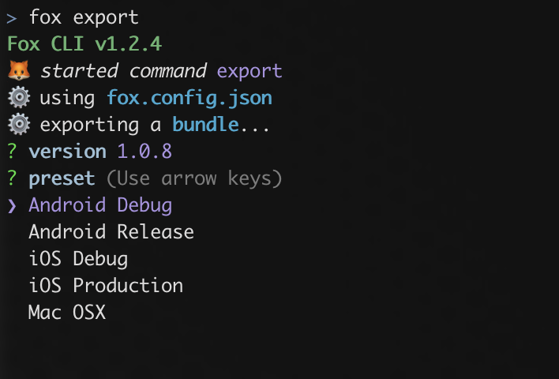

# 🔋 experimental NodeJS CLI

- to watch your files and allow to `live reload` your game.
- to `export` your debug and release bundles.
- to `generate` your release icons and screenshots.



## requirements

To use the CLI you'll need NodeJS installed.

The `fox generate:*` commands also need **ImageMagick 7** (`magick` binary):

```sh
brew install imagemagick
```

See [install](./install.md#prerequisites) for the full prerequisites table.

### prepare the executable

Install the dev dependencies from the fox folder:

```sh
cd path/to/fox
npm install
```

link the `fox` executable:

macOS:

```sh
ln -s ~/Projects/uralys/gamedev/fox/cli/cli.js /usr/local/bin/fox
```

WSL/Linux:

```sh
sudo ln -s /home/user/Projects/uralys/gamedev/fox/cli/cli.js /usr/local/bin/fox
```

Windows (PowerShell):

Add a function to your PowerShell profile (`$PROFILE`):

```powershell
function fox { node "C:\Users\chris\Projects\uralys\gamedev\fox\cli\cli.js" @args }
```

You may have to reload your terminal to have `fox` in your path;

You can now execute fox commands from your terminal:

```sh
fox
```

You can pass parameters to Godot by using them directly from the command line.

See all available parameters on [Godot CLI Reference](https://docs.godotengine.org/en/stable/tutorials/editor/command_line_tutorial.html#command-line-reference)

Example:

```sh
fox run:game --headless --debug-collisions
```

### project detection

Every command starts by checking that the current folder is a game using Fox.
The probe is the runtime's `default.config.json`, looked up under the mount
holding it: `addons/fox/default.config.json` first, then the legacy `fox/`
mount for a game whose runtime has not been moved to `addons/` yet. Every other
runtime file the CLI reads (the boot splash sources included) is resolved the
same way, addon mount first.

When neither mount carries it, the command stops on:

```txt
<current folder> is not a project using Fox: no addons/fox/default.config.json
```

The error names the addon mount even for a legacy project, because that is
where the runtime is expected to live from now on. The legacy candidate is a
transition tolerance: it goes away once every game is migrated.

### lint

The CLI sources under `cli/` are linted and formatted with
[Biome](https://biomejs.dev/), configured in `biome.json` at the root of the
repository. Check the sources without touching them:

```sh
npm run lint
```

Apply the fixes Biome can apply on its own (formatting included):

```sh
npm run lint:fix
```

## usage

```ini
Usage: fox <command> [options]

Commands:
  fox run:editor                open Godot Editor with your main scene

  fox run:game                  start your game locally (watch + hot reload)

  fox import [--force]          import assets headless, as the editor does
                                when opening the project

  fox tag [patch|minor|major]   bump version in project.godot and create a
                                git tag

  fox upgrade [version]         pin addons/fox to a released version
                                (latest by default)

  fox link [path-to-fox]        mount your local fox checkout in
                                addons/fox, to follow it live

  fox export                    export a bundle for one of your presets

  fox export:web                scriptable HTML5 export into _build/web,
                                NOT shippable (no bundle bake): use
                                `fox export` to ship a web build

  fox publish [store] [env]     upload exported builds to a store
                 [branch]       (steamcmd for steam, butler for itch)

  fox switch                    switch from a bundle to another (writes
                                override.cfg)

  fox ls                        list the local exports and confront them
                                with every store the project publishes to

  fox ls:steam                  confront the local Steam exports with the
                                builds installed on the Steam Deck

  fox ls:itch                   confront the local itch exports with the
                                builds live on the itch.io page

  fox generate:icons            generate icons, using a base 1200x1200 image

  fox generate:splashscreens    generate the iOS launch storyboard images,
                                extending a background color from a centered
                                base image

  fox generate:boot-splash      generate the boot splash frame Godot paints
                                before any script runs

  fox generate:screenshots      resize store screenshots to the required sizes

  fox generate:steam-screenshots  resize screenshots for the Steam store

  fox update-po-files           run msgmerge on the project .po translation
                                files (experimental)
```

- more details for exporting [here](./exporting/export.md)
- the two axes a build is made of, `env` and `target`, are described [here](./exporting/envs-and-targets.md)
- the five `fox generate:*` commands drive **ImageMagick 7** (`brew install imagemagick`): see [prerequisites](./install.md#prerequisites)
- where the generated assets land, and what each export keeps: [generated assets](#generated-assets)

## generated assets

Three commands write into `assets/generated/`, and they all share the same
layout: **one folder per bundle, one folder per platform**. An export preset
reads its own folder and excludes every other one, so an iOS build no longer
carries the Windows icons of a bundle it knows nothing about.

```txt
assets/generated/
├── boot-splash.png                 1920x1080, logo 920 px (project wide)
└── <bundleId>/
    ├── ios/
    │   ├── icon-40x40.png … icon-1024x1024.png   (40, 58, 60, 76, 80, 87,
    │   │                                          120, 152, 167, 180, 1024)
    │   ├── splash@2x.png           1170x2532
    │   └── splash@3x.png           1290x2796
    ├── android/
    │   ├── icon-192x192.png
    │   ├── adaptive-background.png
    │   └── adaptive-foreground.png
    ├── desktop/
    │   ├── icon.png                512x512
    │   ├── icon.ico                256, 128, 64, 48, 32, 16 in one file
    │   └── icon.icns               macOS only, see below
    └── web/
        ├── pwa-144x144.png
        ├── pwa-180x180.png
        └── pwa-512x512.png
```

`<bundleId>` comes from the `bundles` section of your `fox.config.json`. A
project without that section gets a single `default/` folder: same layout, so
the presets never need a special case.

The whole folder is generated, therefore disposable: it belongs in your
`.gitignore`, and any of these commands rebuilds it from `_release/images/`.

### generate:icons

```sh
fox generate:icons
```

It loops over every bundle and produces, from your base image, only the sizes an
export preset actually reads. The seven sizes no build ever consumed (20, 29,
32, 64, 128, 256, 512) are not written anymore.

```json
"generate:icons": {
  "input": "_release/images/",
  "output": "assets/generated",
  "base": "icon-1200x1200.png",
  "desktop": "icon-desktop-512x512.png",
  "background": "adaptive-background.png",
  "foreground": "adaptive-foreground.png"
}
```

The desktop icons deserve a word: `icon.ico` is a genuine multi-resolution icon
(six frames in one file) and `icon.icns` is built by `iconutil`, which only
exists on macOS. On Linux and Windows the `.icns` is **skipped with a warning**,
never treated as a failure. See [prerequisites](./install.md#prerequisites).

### generate:splashscreens

```sh
fox generate:splashscreens
```

iOS dropped the launch images: a build now ships a **launch screen storyboard**,
which needs two images instead of eleven. The command writes them per bundle,
next to the iOS icons:

```json
"generate:splashscreens": {
  "input": "_release/images/base-splashscreen.png",
  "output": "assets/generated",
  "backgroundColor": "#181818"
}
```

The base image is centered on a `backgroundColor` canvas extended to the target
size. The three preset keys these images feed:

```ini
storyboard/use_launch_screen_storyboard=true
storyboard/custom_image@2x="res://assets/generated/<bundleId>/ios/splash@2x.png"
storyboard/custom_image@3x="res://assets/generated/<bundleId>/ios/splash@3x.png"
```

You do not have to type them: `fox export` writes them for you, see below.

### generate:boot-splash

```sh
fox generate:boot-splash
```

The boot splash is the very first image Godot paints, before a single script
runs (`application/boot_splash/image` in `project.godot`). It is project wide,
not per bundle, and lands in `assets/generated/boot-splash.png`.

```json
"generate:boot-splash": {
  "input": "res://addons/fox/assets/splash/logo-uralys.png",
  "output": "assets/generated/boot-splash.png",
  "backgroundColor": "#000000"
}
```

The geometry is **not** configurable, on purpose: the boot splash, the animated
splash screen and the iOS launch storyboard must show the same logo at the same
size, so the canvas and the logo width are read from `BASE_CANVAS` and
`LOGO_BASE_WIDTH` in `addons/fox/components/splash/splash-screen.gd`. Change the
constant there, run the command again, and the three surfaces stay aligned.

Keep `backgroundColor` equal to your `boot_splash/bg_color`, or a seam shows
when the boot splash hands over to the animated one.

### what the export excludes on its own

The generated part of every `exclude_filter` now belongs to fox. On each
`fox export`, the preset being exported gets the foreign generated folders
listed for it: the other platforms of its own bundle, then the other bundles
whole.

```ini
exclude_filter="*.md,assets/generated/lockey-land/ios/*,assets/generated/lockey-land/desktop/*,assets/generated/lockey-land/web/*,assets/generated/chapter1/*"
```

Three things follow:

- the filters you wrote yourself are **preserved**: only the tokens starting
  with `assets/generated/` are rewritten, everything else is left alone;
- the rewrite is **idempotent**: exporting twice gives the same filter, filters
  never pile up;
- stop maintaining these lines by hand. Removing your handwritten
  `assets/generated/...` tokens is safe, fox writes them back.

The same pass fixes the icon and storyboard slots of the preset, and an export
whose declared `res://assets/generated/...` file is missing is **refused**, with
the name of the file and the `fox generate:*` command to run.

### migrating a game from the flat folder

Projects created before this layout keep a flat `assets/generated/icons/`. Five
steps, and no preset edited by hand:

1. in your `fox.config.json`, point both `generate:icons.output` and
   `generate:splashscreens.output` at the shared root `assets/generated` (a
   legacy icons `output` ending in `/icons` is normalised anyway);
2. declare `bundles` if the game ships several, so each one gets its folder;
3. run `fox generate:icons`, `fox generate:splashscreens` and
   `fox generate:boot-splash`;
4. run `fox export` once per preset: the icon slots, the storyboard slots and
   the `exclude_filter` are rewritten to the new convention;
5. delete the leftover flat `assets/generated/icons/` and
   `assets/generated/splashscreens/` folders.

A preset hand written long ago may still declare an iOS slot for one of the
seven abandoned sizes (20, 29, 32, 64, 128, 256, 512). Nothing generates those
any more, so the export preflight refuses the build until the slot is cleared:
empty it in `export_presets.cfg`. A stock Godot 4 preset never carries one.

## publish

```sh
fox publish              # asks the store, then the env, then the branch
fox publish itch demo
fox publish steam release main
```

`fox publish` uploads the bundles already sitting in `export/<env>/<target>/`.
It never talks to a store API itself: it drives the **official command line tool
of that store**, so the tool used depends on where the build goes.

| store | tool used | what it uploads | install |
|---|---|---|---|
| `steam` | `steamcmd` | one folder per **depot** | [SteamCMD](https://developer.valvesoftware.com/wiki/SteamCMD) |
| `itch` | `butler` | one folder per **channel** | [butler](https://itch.io/docs/butler/installing.html) |

You only need the tool of the store you publish to: a project shipping to itch.io
alone never installs SteamCMD.

### steam, with steamcmd

SteamPipe uploads a build described by VDF scripts. Fox writes them for you in
`_build/steam/` from the depots declared in `fox.config.json`, then runs:

```sh
steamcmd +login <your-partner-login> +run_app_build _build/steam/app_build_<appId>.vdf +quit
```

The Steam Guard prompt reaches your terminal, so the first login of the day is
answered right there. When a branch is given, the build is set live on it; with
no branch, it stays unassigned and waits for you in Steamworks › SteamPipe ›
Builds.

### itch.io, with butler

itch.io has no depots: each folder is pushed to a **channel**, and the channel
name is what tells itch which platform it is (a name carrying `windows`, `linux`
or `osx`). Fox runs one push per declared channel:

```sh
butler push export/demo/itch/windows uralys/my-game:windows-demo --userversion 0.20.0
```

### before either one

Whatever the store, the same gate runs first: the version and env are read back
from the **bytes in the export folder**, not from `project.godot`, and shown for
confirmation. If they disagree, the first answer offered is the `fox export` that
would fix it.

Stores, credentials, depots and channels are declared in `fox.config.json`, and
are described in [env and target](./exporting/envs-and-targets.md).

## ls

`fox ls` answers one question, store by store: **is the build that ships the one sitting in my export folder?**

Neither half can answer it alone. The store knows a build number and a channel, but nothing about what those bytes contain; the export folder knows a version, but not whether the store ever shipped it. So both sides are read and confronted.

```sh
fox ls          # every store declared under publish
fox ls:steam    # the Steam half only
fox ls:itch     # the itch.io half only
```

Every env declared under `publish.<store>.envs` in `fox.config.json` is listed, so a project shipping a demo next to the game gets both.

### ls:steam — against the Steam Deck

The confrontation is on the **PCK**: the payload itself, identical across platforms unlike the executable.

```txt
●  Fox v1.16.1 ls:steam
├─ Faraday Corridors — project.godot is 0.23.0
●  Local STEAM DEMO — appId 4873710 — export/demo/steam/
│  ┌──────────────────────────────────────────────────────────────────┐
│  │ windows: 0.23.0 DEMO — exported 2026-09-03 19:25 645fd7567aba    │
│  │ linux: 0.23.0 DEMO — exported 2026-09-03 19:25 f33d253d3199      │
│  │ macos: faraday-corridors-demo.zip — archive not read             │
│  │ steam deck: build 25107059 on "staging" — 0.23.0 DEMO f33d253d3199 │
│  └──────────────────────────────────────────────────────────────────┘
├─ ✓  demo: the deck runs the exact export/demo/steam/linux payload (0.23.0)
```

It warns about:

- the depots disagree on the version, or the export is behind `project.godot`
- the branch **requested** differs from the branch **mounted** (Steam needs a restart)
- `buildid` differs from `TargetBuildID` — an update is pending on the Deck
- the Deck PCK is not the local `linux` one, with both short sha256 shown

The Deck is optional: it is a listing, never a gate. An unreachable Deck prints one info line and the local half is reported on its own.

```txt
●  SteamDeck deck@steamdeck.local not connected — local builds only (…)
```

The host defaults to `deck@steamdeck.local` over `ssh` in batch mode. Override it per project:

```json
{
  "ls": {
    "host": "deck@steamdeck.local",
    "timeout": 8
  }
}
```

### ls:itch — against the itch.io page

`butler status --json` gives, for each channel, the build that is live on the page.

```txt
●  Fox v1.16.1 ls:itch
├─ Faraday Corridors — project.godot is 0.23.0
●  Local ITCH.IO DEMO — uralys/faraday-corridors — export/demo/itch/
│  ┌─────────────────────────────────────────────────────────────────────────────┐
│  │ windows-demo: windows/ 0.23.0 DEMO — exported 2026-09-07 12:13 8689bc0714d9 │
│  │   live: build #1955545 — 0.23.0 — pushed 2026-09-07 12:43                   │
│  │ html5-demo: web/ 0.23.0 DEMO — exported 2026-09-07 12:13 a94eb0dd250a       │
│  │   live: build #1955548 — 0.23.0 — pushed 2026-09-07 12:43                   │
│  └─────────────────────────────────────────────────────────────────────────────┘
●  itch ✓  demo: uralys/faraday-corridors is live in 0.23.0 on all 4 channels
```

Here the confrontation is on the **version**, not on a hash: butler stores a build as a diff against its parent and never exposes the bytes it reassembled, so there is no equivalent of the Deck's PCK sha. What it does expose is the `userVersion` `fox publish` stamped on the push — itself read from the payload — so it still says whether the page carries these exact bytes' release.

It warns about:

- the channels disagree on the version, or the export is behind `project.godot`
- a declared channel that has **never been pushed**
- a live build still `processing` or `failed` rather than `completed`
- a channel live in a version other than the one in the local folder

A channel live on the page but no longer declared in `fox.config.json` is named too, as information: an old push leaves one behind, and nothing here removes it.

itch is optional the same way. No `butler`, or a `butler` that cannot reach the API, prints one info line and the local half is reported on its own.

```txt
●  itch uralys/faraday-corridors not read — local builds only (butler not found — …)
```

## upgrade and link

A game mounts the Fox runtime at `res://addons/fox` in one of two ways, and
these two commands switch between them. Both leave the mount ready to reimport:
run `fox import` afterwards.

Every command opens on the mount it is about to work with, so the two versions
at play are never confused: the CLI's own on the left, the mounted addon's on
the right.

```txt
● Fox v2.0.0 ls — addons/fox 2.0.0 (linked)
● Fox v2.0.0 import — addons/fox 1.9.0 (pinned)
● Fox v2.0.0 ls — fox (legacy mount)
```

```sh
fox upgrade          # pin addons/fox to the latest release
fox upgrade 2.1.0    # or to a given one (the `v` prefix is optional)
fox link             # follow ../fox instead, live
fox link ../../fox   # or a checkout somewhere else
```

`fox upgrade` **deletes** `addons/fox` before laying the new version down, so a
file dropped between two versions leaves with it. Reinstalling by hand, or
through the Godot Asset Library, only writes over what the new version happens
to contain, and the leftovers pile up.

It refuses to run on a linked mount, because replacing a link with a pinned copy
is rarely what someone typing `upgrade` expects: pass `--yes` to mean it.

`fox link` is the mount to develop Fox itself against a game. It records the
link relative to the game when given a relative path, so it survives being
committed and cloned elsewhere, and absolute when given an absolute one. A
linked game rides your working tree, so the version in `plugin.cfg` is no longer
a released one: the boot line says `[🦊 Fox] 2.0.0 (symlinked)` to keep a build
log honest.

## import

```sh
fox import           # incremental: only outdated assets
fox import --force   # wipes .godot/imported, reimports everything
```

`fox import` runs `godot --headless --path . --import`, which boots the editor
without its window: same `EditorFileSystem` scan as opening the project
(autoloads, enabled editor plugins, `EditorScenePostImport` scripts, per-file
`.import` settings), then quits once the import is done.

It is **incremental**, exactly like the editor: an asset whose source and import
settings did not change is not reimported. `--force` deletes the
`.godot/imported` cache first, so everything is rebuilt — the `.import` files
are never touched, your import settings are preserved.

Being headless, there is no `RenderingDevice`: GPU texture compression falls
back to the CPU compressor (slower, same format) and no filesystem thumbnails
are generated. Godot returns `0` even when an importer logs an error, so read
the output rather than trusting the exit code.

Useful before any headless run (tests, screenshots, export) or after a batch of
assets landed on disk, to avoid opening the editor just for that.

## hot reload

`fox run:game` watches your project files (`.gd`, `.tscn`, `.cfg`, `.json`, `.yml`) and hot reloads the current scene when a change is detected.

Instead of killing and restarting the Godot process, it writes a `.hot-reload` trigger file. The `HotReload` autoload inside Godot detects this file and calls `Router.reloadCurrentScene()`, which re-instantiates the current scene without closing the window.

### Setup

Add `HotReload` to your project's `[autoload]` section in `project.godot`:

```ini
[autoload]

HotReload="*res://addons/fox/autoloads/hot-reload.gd"
```

Add `.hot-reload` and `.nav-state` to your `.gitignore`.

### Ignoring folders

`.worktrees/` and `.godot/` are always ignored. To skip additional folders (tooling, generated data, sub-projects), list them in `run:game.ignored` of your `fox.config.json`:

```json
{
  "run:game": {
    "ignored": ["solutions"]
  }
}
```

### Navigation state (NavState)

The Router persists a typed `NavState` (`addons/fox/core/nav-state.gd`) to `.nav-state` (JSON). It stores the current scene path and a `path` array representing nested sub-view segments — similar to outlets in Ember.js or React Router.

On hot reload or full restart (`r`), the app restores the last visited scene and navigates to the exact sub-view.

**NavState JSON example:**

```json
{"scene_path":"res://src/screens/storybook.tscn","path":["Focal Blur"]}
```

**Router API:**

- `Router.getNavPath() -> Array` — read the current path segments
- `Router.setNavPath(path: Array)` — update and persist the path
- `Router.restoreOrDefault(defaultAction: Callable)` — restore nav state on startup, or call default

**Scene pattern — each scene reads/writes its own path segments:**

```gdscript
func onOpen(options = {}):
    var navPath = Router.getNavPath()
    if not navPath.is_empty():
        selectedEntry = navPath[0]        # restore from navPath
    else:
        selectedEntry = __.GetOr('default', 'entry', options)  # normal nav
    Router.setNavPath([selectedEntry])

func _onSubViewSelected(name: String):
    Router.setNavPath([selectedEntry, name])  # nested sub-view
```

**Startup (main.gd) — use `restoreOrDefault` in debug mode:**

```gdscript
func run():
    Router.restoreOrDefault(func(): Router.openHome())
```

### Limitations

In standalone mode, GDScript files are compiled on load. Hot reload works well for data changes (JSON, resources) and `.tscn` scenes. For `.gd` script changes, the scene is re-instantiated but scripts in memory may not update — use `r` for a full restart in that case.

## shortcuts

- `r` — full restart (kills and relaunches Godot, useful when hot reload is not enough)
- `ctrl + c` — stop the game
