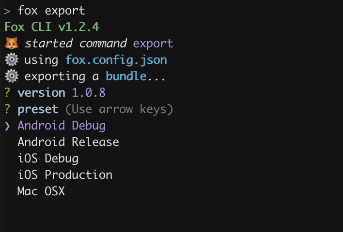

# 🔋 experimental NodeJS CLI

- to watch your files and allow to `live reload` your game.
- to `export` your debug and production bundles.
- to `generate` your release icons and screenshots.



## requirements

To use the CLI you'll need NodeJS installed

### prepare the executable

Install the dev dependencies:

```sh
npm install
```

link the `fox` executable:

```sh
ln -s ~/Projects/uralys/gamedev/fox/cli/cli.js /usr/local/bin/fox
```

You may have to reload your termilnal to have `fox` in your path;

You can now execute fox commands from your terminal:

```sh
fox
```

You can pass parameters to Godot by using them directly from the command line:

```sh
fox run:game --headless
```

## usage

```ini
Usage: fox <command> [options]

Commands:
  fox run:editor              open Godot Editor with your main scene

  fox run:game                start your game to debug

  fox export                  export a bundle for one of your presets

  fox generate:icons          generate icons, using a base 1200x1200 image

  fox generate:splashscreens  generate splashscreens, extending a background
                              color from a centered base image

  fox generate:screenshots    resize all images in a folder to 2560x1600, to
                              match store requirements
```

- more details for exporting [here](./docs/export.md)

## shortcuts

You can use the following shortcuts in the terminal:

- `ctrl + c` to stop the current command
- `r` to reload the game (only with the `run:game` command)
