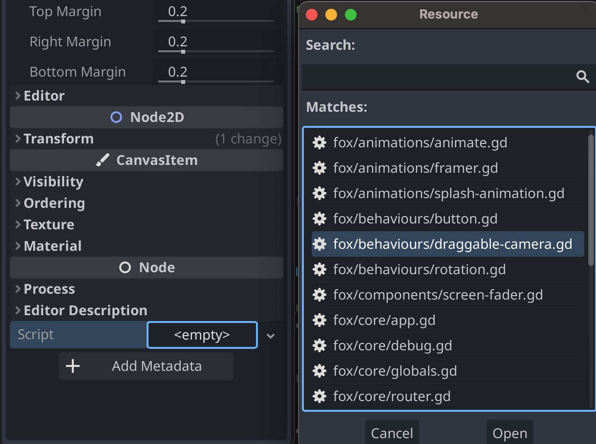
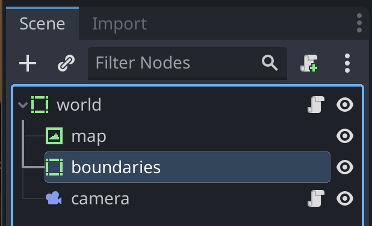

# Draggable Camera

To enable dragging a Camera2D, you can attach the [draggable-camera](../../fox/behaviours/draggable-camera.gd) script to any Camera2D Node.

## Setup

Create a `Camera2D` node, and look for the [draggable-camera](../../fox/behaviours/draggable-camera.gd) script to it from the Inspector.

Now, if you add a `TextureRect` as a sibling of the Camera2D, you'll be able to drag it to move the camera.

## Boundaries

(Experimental) Adding a sibling `ReferenceRect` called `boundaries` allows boundaries to be set for the camera.

