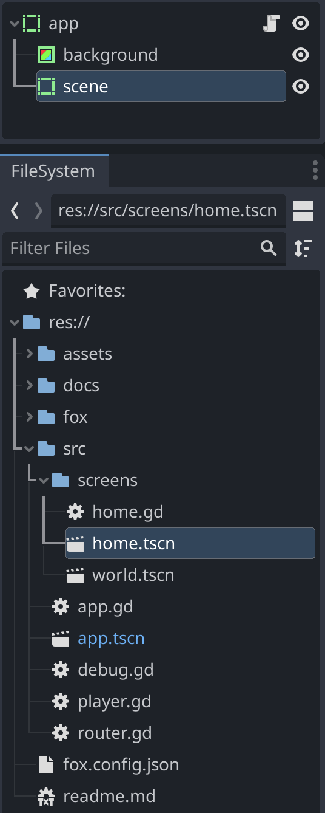
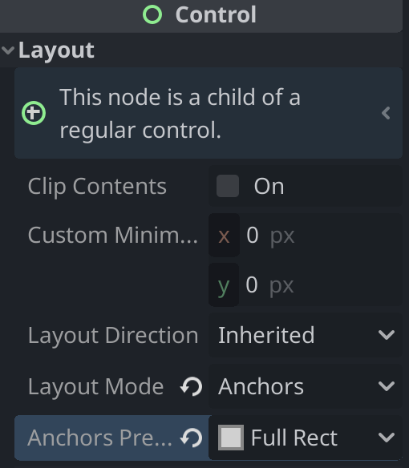

# Router

The Fox `Router` switches scenes easily, simplifies screen transitions, persists
navigation state, and exposes shared UI overlays (loader, fader) and threaded
resource loading.

## Setup

To use the Router, your top scene must be named `app`, and it must have a child
node named `scene` (where screens are mounted) — plus a `popups` child for
overlays.

To allow your screens to be full screen:

- `app` and `scene` can be 2 `ReferenceRect`
- use `Layout mode: Uncontrolled`
- use `Anchors preset: Full Rect`



To illustrate `scene` layout:



## Initial code

- Extend `router.gd` from `fox/core/router.gd`
- Implement your `openXXX` by calling `openScene`

```gdscript
extends 'res://fox/core/router.gd'

var home = preload("res://src/screens/home.tscn")

func openHome(options = {}):
  openScene(home, options)
```

Add it as an `Autoload` named `Router`. Now you can call `Router.openHome()`
anywhere, for example from your `app.gd/_ready()`.

## Screen transitions and options

To handle passed `options`, implement `onOpen` in your screen:

```gdscript
# home.gd
func onOpen(options):
  print('opened home with options', options)
```

```gdscript
Router.openHome({plip = 'plop'})
```

Lifecycle hooks you can override:

- on the **screen**: `onOpen(options)` (entering), `onLeave(options)` (leaving)
- on the **router**: `onOpenScene()` (return a number of seconds to wait while
  leaving, for a transition), `onSceneReady()`, `openDefault()` (fallback on
  error)

## Navigation API

- `Router.openScene(scene, options = {})` — open a scene (deferred)
- `Router.getCurrentScene()` / `Router.getCurrentSceneName()`
- `Router.reloadCurrentScene()` — re-instantiate the current scene (used by hot
  reload)

### Navigation state

The Router persists a typed `NavState` (scene path + a `path` array of sub-view
segments) so the app can restore exactly where it was after a hot reload or
restart. See the [CLI / hot reload doc](../cli.md#navigation-state-navstate) for
the full pattern.

- `Router.getNavPath() -> Array`
- `Router.setNavPath(path: Array)`
- `Router.restoreOrDefault(defaultAction: Callable)`

## UI overlays

- `Router.showLoader()` / `Router.hideLoader()` — fullscreen blurring loader (see
  [components](./components.md#fullscreen-loader))
- `Router.useScreenFader(duration = 0.75)` — fade transition over the current
  scene (see [components](./components.md#screen-fader))

Popups are added under `$/root/app/popups`. The Router also has optional
`openSettings()` / `openLanguages(options)` helpers — set `SettingsPopup` /
`LanguagesPopup` in your router to use them.

## Threaded resource loading

Load heavy resources off the main thread and poll progress (e.g. behind the
loader):

```gdscript
Router.startLoadingResource(path)

# each frame / in _process
var progress = Router.getLoadingProgress()   # 0 → 1

# when done (Router emits `loaded`)
var resource = Router.finishedLoadingResource()
var cached = Router.getLoadedResource(path)
```
