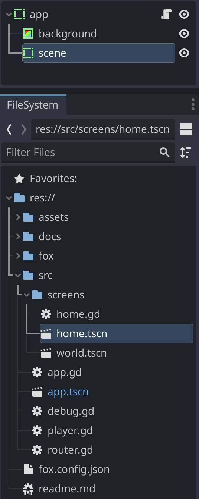
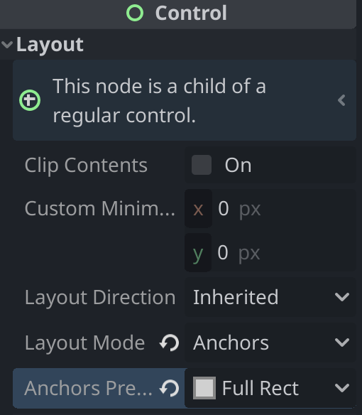

# Router

Fox router enables to switch scenes easily, and simplifies screen transitions.

## Setup

To use Fox router, your top scene must be named `app`, and it must have a child scene named `scene`.

To allow your screens to be full screen:

- `app` and `scene` can be 2 `ReferenceRect`
- use `Layout mode: Uncontrolled`
- use `Anchors preset: Full Rect`



---

To illustrate `scene` layout:



## Initial code

- Extend `router.gd` from `fox/core/router.gd`
- Implement your `openXXX` by calling `_openScene`

```gdscript
extends 'res://fox/core/router.gd'

var home = preload("res://src/screens/home.tscn")

func openHome(options = {}):
  call_deferred("_openScene", home, options)
```

Now you can call `Router.openHome()` anywhere, for example from your `app.gd/_ready()` function.

## Screen transitions and options

To handle passed `options` and screen transitions, you can implement `onOpen` in your screen:

example here in `home.gd`:

```gdscript
func onOpen(options):
  print('opened home with options', options)
```

calling openHome with options:

```gdscript
Router.openHome({plip='plop'})
````
