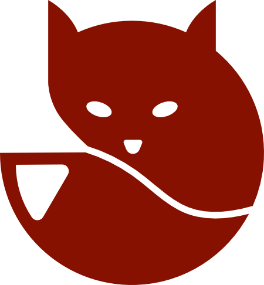
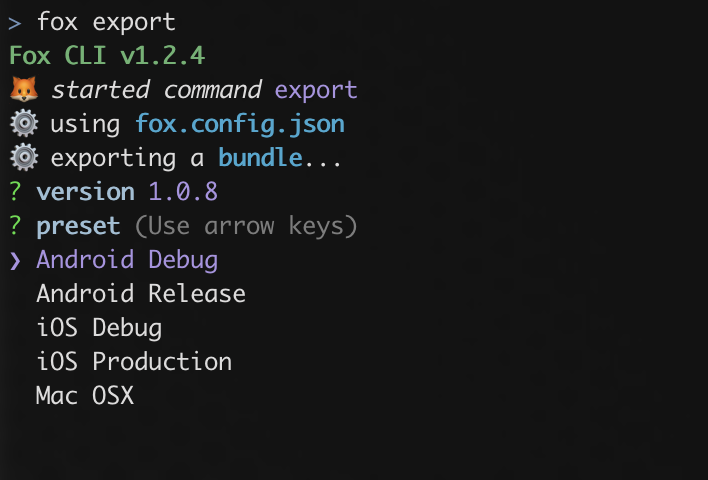

<p align="center"><a href="https://thenounproject.com/icon/fox-1486570/"> </a></p>

# Fox [](license) [](https://github.com/uralys/fox/tags)

🦊 Fox provides many tools to help develop with Godot Engine

## Godot `functions` and `libs`

You can use elements from the `/fox` folder:

- generic static libs (`Wait`, `__.Get`, `__.Set`...)
- behaviours (`button` behaviour to use signal `onPress`, `draggableCamera` for a 2D camera to be...draggable)
- tween animations for your objects (`Animate.show`, `Animate.to` ...)
- handle sounds anywhere easily (`Sound.play`)

Few documentation links:

- [general](./docs/godot-elements.md)
- [animation](./docs/animations.md)

### Example

```gd
# showing the car smoothly
Animate.show(car)

# then wait for 2 seconds
var timer = Wait.start(car, 2)
yield(timer, 'timeout')

# then moving the car to (200, 200)
Animate.to(car, {
  propertyPath = 'position',
  toValue = Vector2(200, 200),
  duration = 0.5
})
```

## NodeJS CLI

- to watch your files and allow to `live reload` your game.
- to `export` your debug and production bundles.
- to `generate` your release icons and screenshots.



## 📦 Install

clone this repo next to your game folders

```sh
git clone https://github.com/uralys/fox
```

```sh
└── your-gamedev
  ├── fox
  ├── your-game1
  └── your-game2
```

To keep same paths and `res://`, symlink godot elements in the `/fox` folder like this:

```sh
cd /path/to/your-game
ln -s ../fox/fox fox
```

## 🔋 CLI

### requirements

To use the CLI you'll need NodeJS installed

### prepare the executable

Install the dev dependencies:

```sh
npm install
```

link the `fox` executable:

```sh
npm link
```

You can now execute fox commands from your terminal

```ini
Usage: fox <command> [options]

Commands:
  fox run:editor              open Godot Editor with your main scene

  fox run:game                start your game to debug

  fox export                  export a bundle for one of your presets

  fox generate:icons          generate icons, using a base 1200x1200 image

  fox generate:splashscreens  generate splashscreens, extending a background
                              color from a centered base image

  fox generate:screenshots    resize all images in a folder to 2560x1600, to
                              match store requirements
```

more details for exporting [here](./docs/export.md)
