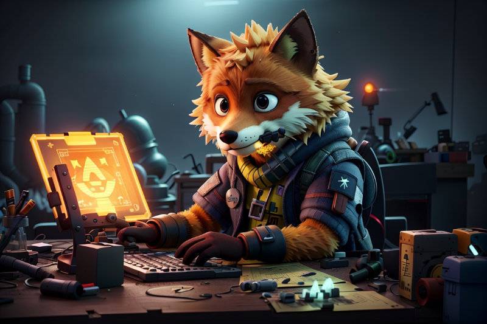
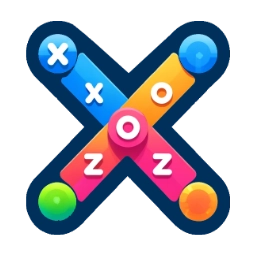
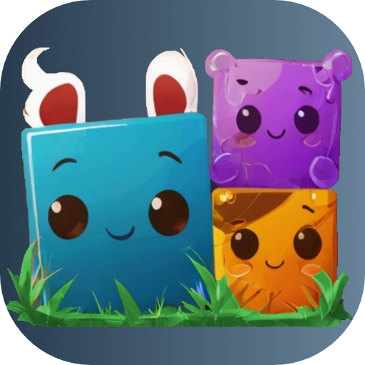
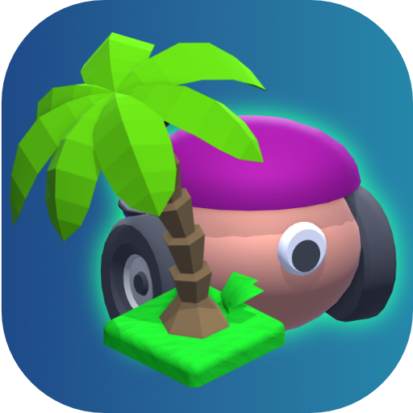
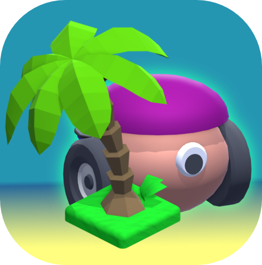
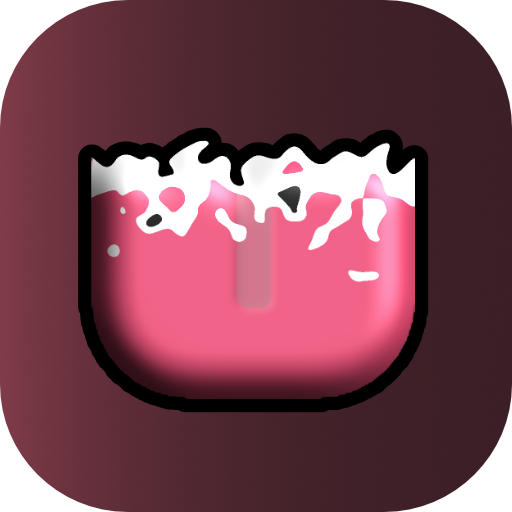

# Fox

[](license) [](https://github.com/uralys/fox/tags)

🦊 Fox provides tooling while developing with Godot Engine.

<p align="center"></p>

## Scenes and scripts

With Fox, you can use `Scenes`, `Resources`, scripts and static functions to build your app.

As an example, this code will move 3 nodes to the same position, with a delay of 1 second between each animation. Finally it fill print 'DONE' in the console.

```gdscript
  Animate.to([potion, car, book], {
    propertyPath = "position",
    toValue = Vector2(0, 0),
    delayBetweenElements = 1,
    onFinished = func():
      G.log('DONE');
  })
```

This other one sends a body to a REST API, handles and logs the result while showing a loader:

```gd
  Router.showLoader()

  HTTP.Post(self, {
    endpoint = "/score",
    body = {playerId = "FieryFox", score = 100},
    onError = func(_result, _response_code, _headers, _body):
      handleScoreFailure()
      Router.hideLoader()
    ,
    onComplete = func(_result, _response_code, _headers, body):
      var _body = body.get_string_from_utf8()
      var newRecord = __.GetOr(false, 'newRecord', _body)
      G.debug(
        '✅ [b][color=green]successfully posted score[/color][/b]',
        {newRecord = newRecord}
      )
      Router.hideLoader()
  })
```

## Documentation

Full documentation lives in [docs](./docs). Start with
[Installing Fox](./docs/install.md).

### Core

- [Globals & Debug](./docs/gdscript/globals.md) — `G` (globals + logging) and
  `DEBUG` (flags)
- [Router](./docs/gdscript/router.md) — scenes, transitions, nav state, overlays
- [Screens & responsive](./docs/gdscript/screens.md) — `FoxScreen`, `FoxPopup`,
  `ViewportResize`
- [Sound](./docs/gdscript/sound.md) — SFX, music, ducking

### Input

- [Controls](./docs/gdscript/controls.md) — unified keyboard / gamepad / stick
  input
- [interactiveArea2D](./docs/gdscript/interactive-area-2d.md) — touch, drag &
  drop on any Node
- [Multitouch Area](./docs/gdscript/multitouch.md) — press / drag listener
- [Draggable Camera](./docs/gdscript/draggable-camera.md)

### Animation & UI

- [Animations](./docs/gdscript/animations.md) — `Animate` Tween helpers +
  `Framer`
- [Motion](./docs/gdscript/motion.md) — procedural idle motion (float, wobble,
  breathe)
- [Popups](./docs/gdscript/popups.md)
- [Components](./docs/gdscript/components.md) — loader, screen fader, ask-for-review

### Libs & utilities

- [HTTP](./docs/gdscript/http.md) — REST client
- [Utility libs](./docs/gdscript/utils.md) — `__` (Underscore), `Wait`,
  `TimeTools`, `Bundle`, `Generate`
- [In-App Purchases](./docs/gdscript/stores.md) — iOS / Android stores

### Tooling & exporting

- [CLI](./docs/cli.md) — run, hot reload, export, publish
- [Building](./docs/exporting/build.md) and [Exporting](./docs/exporting/export.md)
- [Images generation](./docs/exporting/images.md) — icons, splashscreens,
  screenshots
- [Android](./docs/exporting/android.md) and [iOS](./docs/exporting/ios.md)
  settings

## Games created with Fox

<a href="https://uralys.com/xoozz"></a>
<a href="https://uralys.com/battle-squares"></a>
<a href="https://uralys.com/avindi"></a>
<a href="https://uralys.com/lockeyland"></a>
<a href="https://uralys.com/lockeyland"></a>
<a href="https://x.com/battle_squares">
