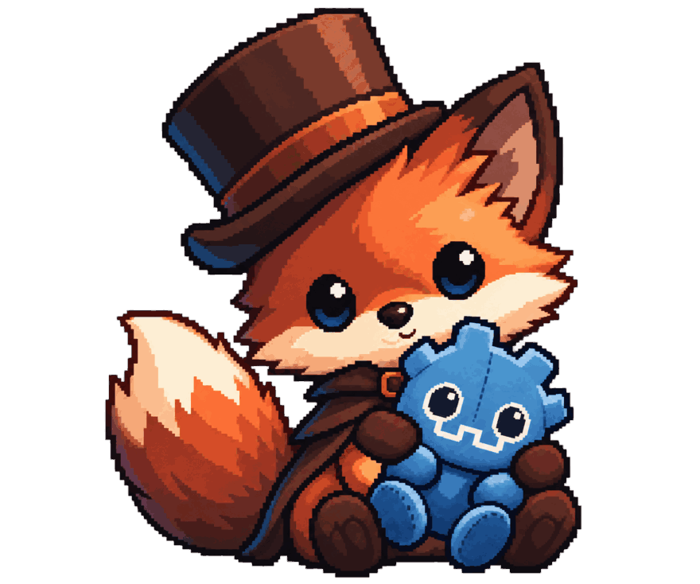
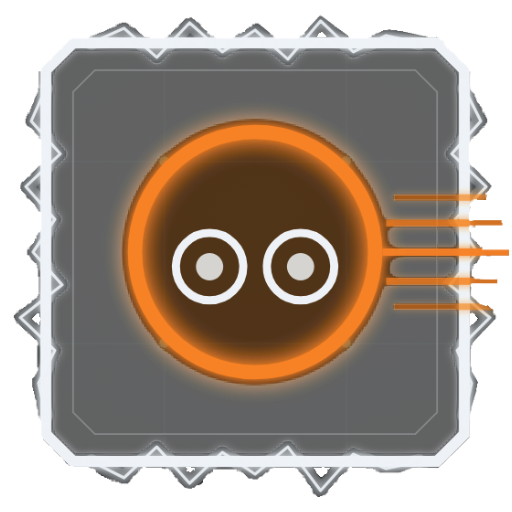
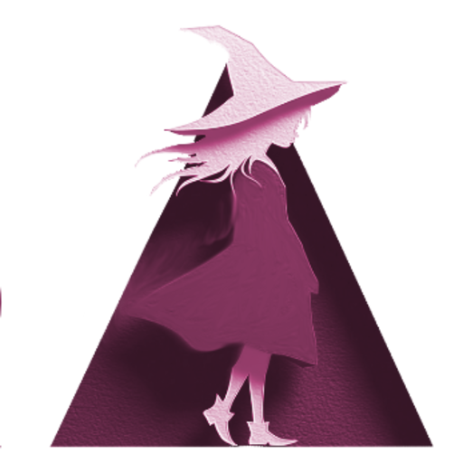
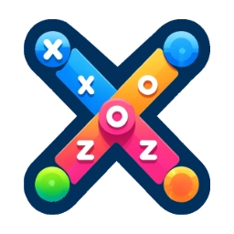
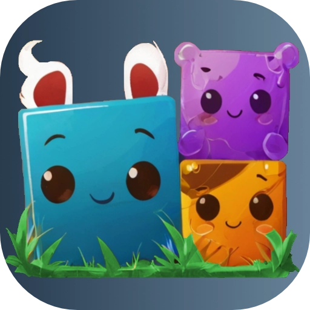
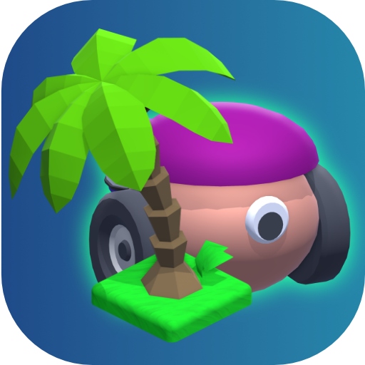
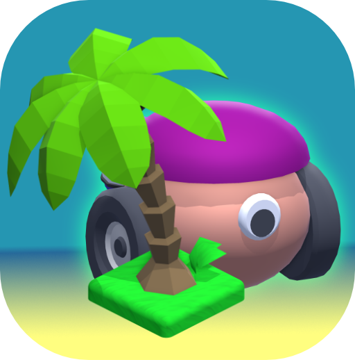
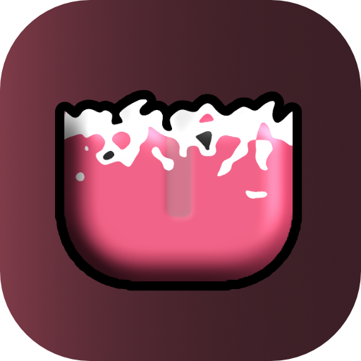

# Fox

[](license) [](https://github.com/uralys/fox/tags)

🦊 Fox provides tooling while developing with Godot Engine.

**From the first scene to the store page**: a skeleton to hang your game on,
GDScript libs that spare you the boilerplate, and one CLI to run, export and
publish on Steam and itch.io.

<p align="center"></p>

## The skeleton

A Fox game is a Godot project with one root scene, one router, and screens. Fox
brings the three of them, then gets out of the way.

```sh
your-game/
├── addons/fox/          # the runtime, pinned at the version you chose
├── fox.config.json      # bundles, exports, stores
├── project.godot
└── src/
    ├── app.tscn         # app > scene + hud
    ├── app.gd
    ├── router.gd
    └── screens/
        ├── home.tscn
        └── home.gd
```

`app.gd` boots the tree Fox expects, and opens your first screen:

```gdscript
extends 'res://addons/fox/core/app.gd'

func _ready():
  super._ready()
  Router.openHome()
```

`router.gd` names your screens once. From anywhere in the game, navigation is
then a single call, `Router.openHome({level = 3})`, with transitions, a loader
and the restored navigation state included:

```gdscript
extends 'res://addons/fox/core/router.gd'

var home = preload('res://src/screens/home.tscn')

func openHome(options = {}):
  openScene(home, options)
```

A screen extends `FoxScreen`: the router instantiates it, hands it what the
navigation passed, and it relays out on its own when the window is resized: the
Steam Deck ↔ desktop split costs nothing per screen.

```gdscript
extends FoxScreen

func onOpen(options):
  _layout()

func _onViewportResized():
  _layout()
```

Everything else is autoloads you call directly: `Animate` and `Motion` for
tweens and idle motion, `Sound`, `HTTP`, `Controls`, `Steam`, `Leaderboard`,
`Gesture`, and the `__` utility belt.

## The CLI

One command per step of a game's life, the same on macOS, Linux and Windows:

```sh
fox run:game                # run your game, hot reloading as you code
fox export                  # export a bundle for one of your presets
fox publish steam release   # upload it to the store
```

Version bumps, asset imports, icons, splashscreens and store screenshots have
their command too: see the [CLI reference](./docs/cli.md).

## Installation

Fox is a standard Godot addon: its runtime tree lives in
[addons/fox](./addons/fox), and a game mounts it at `res://addons/fox`. Copy it
at the version you want, and commit it with your game:

```sh
git clone --depth 1 --branch v2.0.1 https://github.com/uralys/fox /tmp/fox-2.0.1
mkdir -p your-game/addons
cp -R /tmp/fox-2.0.1/addons/fox your-game/addons/fox
```

Then enable it once from `Project > Project Settings > Plugins > Fox`: it
registers the `G`, `DEBUG` and `Gesture` autoloads, and leaves alone any
autoload your game already declares.

Your game is now pinned, and moves to the next Fox when you decide to:
`fox upgrade` swaps `addons/fox` for a released version, whole.

The full walkthrough (prerequisites, main scene, optional autoloads) is in
[Installing Fox](./docs/install.md).

> Coming from Fox 1.x? The runtime moved from `res://fox/` to
> `res://addons/fox/`: see the [2.0.0 release notes](https://github.com/uralys/fox/releases/tag/v2.0.0)
> for the migration steps.

## Documentation

The full index lives in [docs](./docs/readme.md):

- [Core](./docs/readme.md#core): globals, router, screens & responsive, sound,
  files, Steam, leaderboard
- [Input](./docs/readme.md#input): controls, touch & drag, multitouch,
  draggable camera
- [Animation & UI](./docs/readme.md#animation--ui): `Animate`, `Motion`,
  popups, components
- [Libs & utilities](./docs/readme.md#libs--utilities): HTTP, `__`, frame
  probe, in-app purchases
- [Tooling & exporting](./docs/readme.md#tooling--exporting): CLI, building,
  exporting, images, Android & iOS

## Games created with Fox

<a href="https://store.steampowered.com/app/4758990/Faraday_Corridors/"></a>
<a href="https://uralys.com/sylvestrine"></a>
<a href="https://uralys.com/xoozz"></a>
<a href="https://uralys.com/battle-squares"></a>
<a href="https://uralys.com/avindi"></a>
<a href="https://uralys.com/lockeyland"></a>
<a href="https://uralys.com/lockeyland"></a>
<a href="https://x.com/battle_squares">
