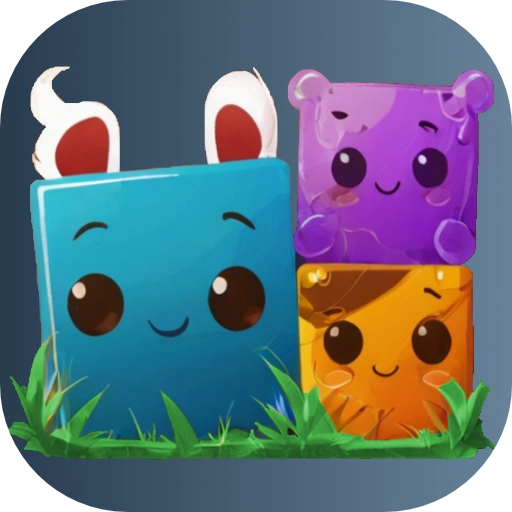

# Fox

[](license) [](https://github.com/uralys/fox/tags)

🦊 Fox provides tooling while developing with Godot Engine.

<p align="center"></p>

## Scenes and scripts

With Fox, you can use `Scenes`, `Resources`, scripts and static functions to build your app.

As an example, this code will move 3 nodes to the same position, with a delay of 1 second between each animation. Finally it fill print 'DONE' in the console.

```gdscript
  Animate.to([potion, car, book], {
    propertyPath = "position",
    toValue = Vector2(0, 0),
    delayBetweenElements = 1,
    onFinished = func():
      G.log('DONE');
  })
```

This other one sends a body to a REST API, handles and logs the result while showing a loader:

```gd
  Router.showLoader()

  HTTP.Post(self, {
    endpoint = "/score",
    body = {playerId = "FieryFox", score = 100},
    onError = func(_result, _response_code, _headers, _body):
      handleScoreFailure()
      Router.hideLoader()
    ,
    onComplete = func(_result, _response_code, _headers, body):
      var _body = body.get_string_from_utf8()
      var newRecord = __.GetOr(false, 'newRecord', _body)
      G.debug(
        '✅ [b][color=green]successfully posted score[/color][/b]',
        {newRecord = newRecord}
      )
      Router.hideLoader()
  })
```

## Documentation

Few documentation links (find more in the [docs](./docs)):

- [Installing](./docs/install.md) Fox to use in your Godot app

Coding:

- Using the [Router](./docs/gdscript/router.md)
- Using [Animation](./docs/gdscript/animations.md) Tween helpers
- Using `Touchable` and `Draggable` Nodes with an [interactiveArea2D](./docs/gdscript/interactive-area-2d.md) behaviour on any Node
- Using [Popups](./docs/gdscript/popups.md)
- Using [DraggableCamera](./docs/gdscript/draggable-camera.md)
- Using [Sound](./docs/gdscript/sound.md)
- static functions inspired by [Underscore](/fox/libs/underscore.gd)

Exporting:

- [Installing the CLI](./docs/cli.md)
- Info about [Android](./docs/exporting/android.md) settings and building
- Info about [iOS](./docs/exporting/ios.md) settings and building

## Games created with Fox

<a href="https://uralys.com/xoozz"></a>
<a href="https://uralys.com/battle-squares"></a>
<a href="https://uralys.com/avindi"></a>
<a href="https://uralys.com/lockeyland"></a>
<a href="https://uralys.com/lockeyland"></a>
<a href="https://x.com/battle_squares">
